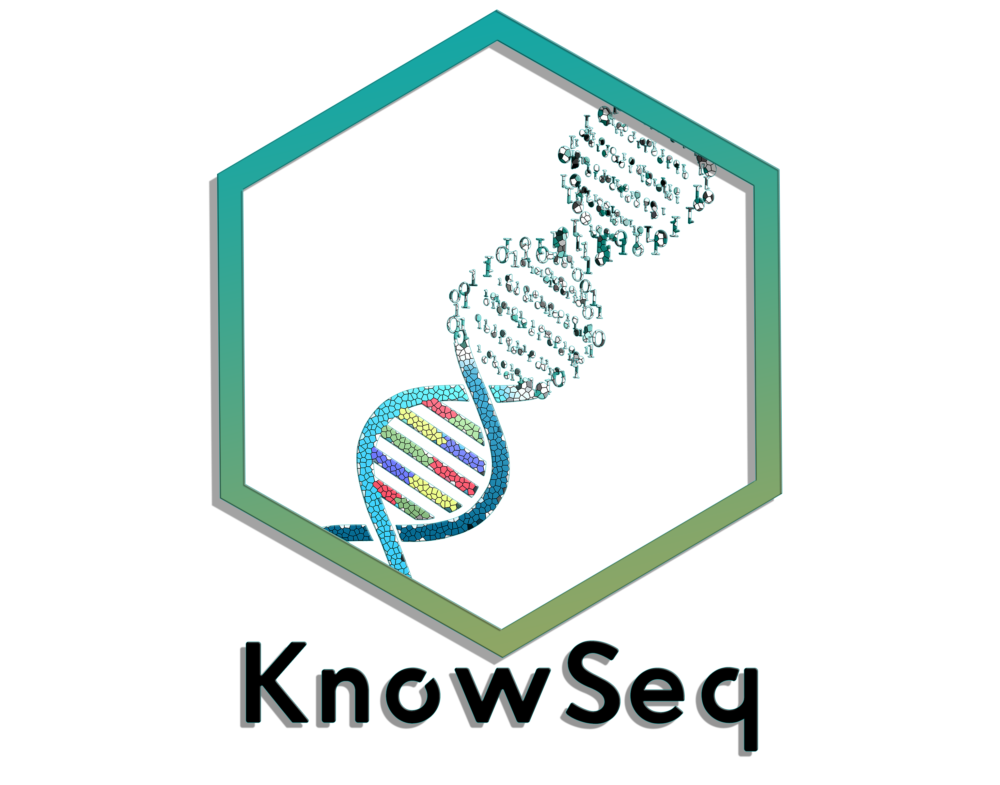

# KnowSeq R/bioc package: Beyond the traditional RNA-seq pipeline.



[](https://bioconductor.org/packages/release/bioc/html/KnowSeq "How long has been KnowSeq in a release of Bioconductor")
[](https://support.bioconductor.org/t/KnowSeq/ "Support site activity on KnowSeq, last 6 months: tagged questions/avg. answers per question/avg. comments per question/accepted answers, or 0 if no tagged posts.")
[](https://github.com/CasedUgr/KnowSeq/graphs/contributors)
[](https://twitter.com/intent/tweet?hashtags=KnowSeq&url=https://bioconductor.org/packages/release/bioc/html/KnowSeq.html&screen_name=CasedUgr)
[](https://github.com/CasedUgr)


**Current build status**
- `release` [](https://bioconductor.org/packages/release/bioc/html/KnowSeq.html#archives "Whether KnowSeq release is available on all platforms") 
[](https://bioconductor.org/checkResults/devel/bioc-LATEST/KnowSeq "Time since last commit, possible values: today, < 1 week, < 1 month, < 3 months, since release, before release")
[](https://bioconductor.org/checkResults/release/bioc-LATEST/KnowSeq/ "Bioconductor release build")
- `development` [](https://bioconductor.org/packages/devel/bioc/html/KnowSeq.html#archives "Whether KnowSeq devel is available on all platforms") 
[](https://bioconductor.org/checkResults/devel/bioc-LATEST/KnowSeq "Time since last commit, possible values: today, < 1 week, < 1 month, < 3 months, since release, before release")
[](https://bioconductor.org/checkResults/devel/bioc-LATEST/KnowSeq/ "Bioconductor devel build")

# Introduction

[KnowSeq](https://bioconductor.org/packages/release/bioc/html/KnowSeq.html) proposes a novel methodology that comprises the most relevant steps in the Transcriptomic gene expression analysis. KnowSeq expects to serve as an integrative tool that allows to process and extract relevant biomarkers, as well as to assess them through a Machine Learning approaches. Finally, the last objective of KnowSeq is the biological knowledge extraction from the biomarkers (Gene Ontology enrichment, Pathway listing and Visualization and Evidences related to the addressed disease). Although the package allows analyzing all the data manually, the main strenght of KnowSeq is the possibilty of carrying out an automatic and intelligent HTML report that collect all the involved steps in one document. Nowadays, there is no package that only from the information of the samples to align -included in a text file-, automatically performs the download and alignment of all of the samples. Furthermore, KnowSeq is the only package that allows applying both a machine learning and biomarkers enrichment processes just after the biomarkers extraction. It is important to highligh that the pipeline is totally modular and flexible, hence it can be started from whichever of the different steps. This pipeline has been used in our previous publications for processing raw RNA-seq data and to perform the biomarkers extraction along with the machine learning classifier design steps, also for their integration with microarray data [1,2,3,4].


The whole pipeline included in KnowSeq has been designed carefully with the purpose of achieving a great quality and robustness in each of the steps that belong to the pipeline. Therefore, the pipeline has four fundamental processes:

- Transcriptomic RAW data processing.
- Biomarkers identification & assessment.
- DEGs enrichment methodology.
- Intelligent Automatic Report.

The first process is focused on the Transcriptomic RAW data treatment. This step has the purpose of extracting a set of count files from raw files stored in the repositories supported by our package (NCBI/GEO ArrayExpress and GDC-Portal). The second one englobes the Differential Expressed Genes (DEGs) identification and extraction by using a novel parameter (Specifically for multiclass studies) defined as Coverage [3], and the assessment of those DEGs by applying advanced machine learning techniques (feature selection process and supervised classification). Once the DEGs are assessed, the next step is the DEGs enrichment methodology which allows retrieving biological information from the DEGs. In this process, relevant information (such as related diseases, biological processes associated and pathways) about the DEGs is retrieved by using very well-known tools and databases. The three types of enrichment are the Gene Ontology (GO) study, the pathways visualization taking into account the gene expression, and the Evidences related to the addressed disease from the final set of DEGs. Finally, all of this information can be displayed on  an automatic and intelligent HTML report that contains the results of the complete study for the faced disease or diseases.

With the pipeline designed and addressed by KnowSeq, researchers can convert the RAW data of RNA-seq into real knowledge for the identification of possible gene signatures about the studied diseases.

KnowSeq expects to serve as a novel tool to help experts to acquire robust knowledge and to draw conclusions for the data and diseases studied. KnowSeq has three clear strengths: the first one is the modular design, because the analyses can be started from different points (FASTQ, BAM, count and even a custom expression matrix); the second one is the versatility due to the different algorithms for Machine Learning and Feature Selection and the different databases implemented in KnowSeq; and the last one is the adaptability of the analyses, because KnowSeq allows to use data from different sources and select different parameters that gives the user a real control over the pipeline.

# Installation
To install and load KnowSeq package in R, it is necessary the previous installation of BiocManager from Bioconductor. The next code shows how this install can be performed:

```{r, eval=FALSE}
if (!requireNamespace("BiocManager", quietly = TRUE))
  install.packages("BiocManager")
  
BiocManager::install("KnowSeq")

library(KnowSeq)
```

KnowSeq is now available on Docker by running the next command and opening the URL localhost:8787 at your browser. The user to Login in is rstudio.

```
Docker run -e PASSWORD=<your_password> -p 8787:8787 casedugr/knowseq
```

# Contributors

Contributors are listed in the [DESCRIPTION](https://github.com/CasedUgr/KnowSeq/blob/master/DESCRIPTION) file.

# Contributions

Contributions are welcomed and each PR would be reviewed by KnowSeq maintainers. Please, provide a useful description for the new contribution. PR guidelines will be added soon.

# Citation

If you find KnowSeq useful and you use it in your work, please cite it as follows:

```
Castillo-Secilla D, Galvez JM, Carrillo-Perez F, Verona-Almeida M, Redondo-Sanchez D, Ortuno FM, Herrera LJ, Rojas. I (2020). KnowSeq: KnowSeq R/Bioc package: Beyond the traditional Transcriptomic pipeline. R package version 1.4.1.
```
# References

1. Castillo, D., Gálvez, J. M., Herrera, L. J., San Román, B., Rojas, F., & Rojas, I. (2017). Integration of RNA-Seq data with heterogeneous microarray data for breast cancer profiling. BMC bioinformatics, 18(1), 506.

2. Gálvez, J. M., Castillo, D., Herrera, L. J., San Roman, B., Valenzuela, O., Ortuno, F. M., & Rojas, I. (2018). Multiclass classification for skin cancer profiling based on the integration of heterogeneous gene expression series. PloS one, 13(5), e0196836.

3. Castillo, D., Galvez, J. M., Herrera, L. J., Rojas, F., Valenzuela, O., Caba, O., ... & Rojas, I. (2019). Leukemia multiclass assessment and classification from Microarray and RNA-seq technologies integration at gene expression level. PloS one, 14(2), e0212127.

4. Gálvez, J. M., Castillo, D., Herrera, L. J., Valenzuela, O., Caba, O., Prados, J. C., ... & Rojas, I. (2019). Towards Improving Skin Cancer Diagnosis by Integrating Microarray and RNA-seq Datasets. IEEE Journal of Biomedical and Health Informatics.
