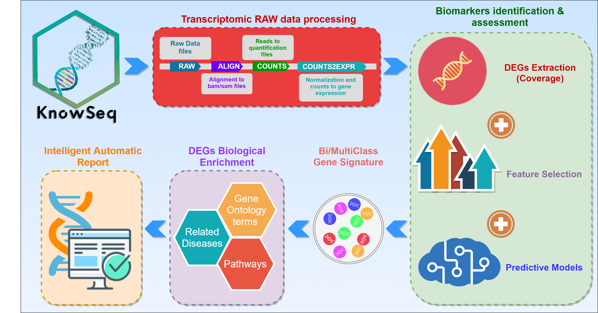
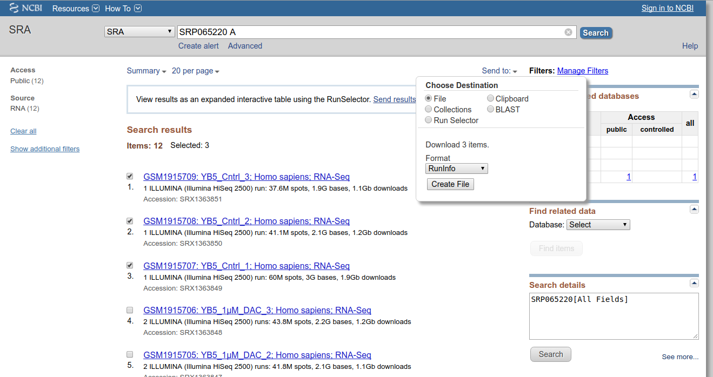
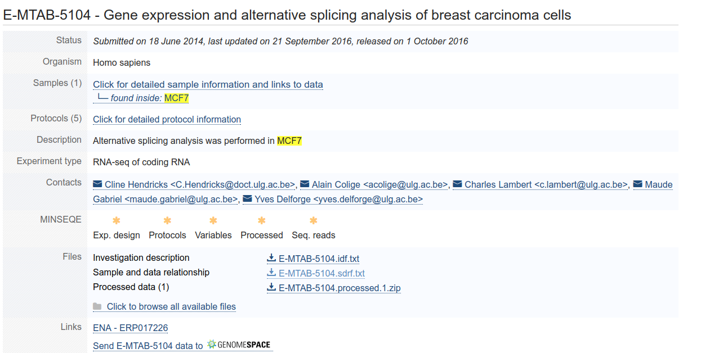
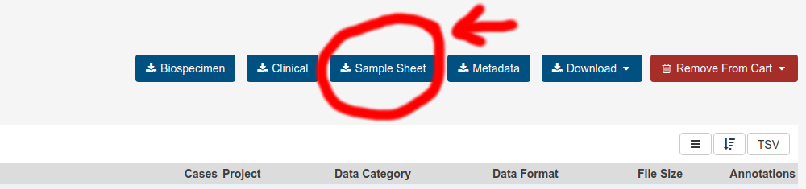
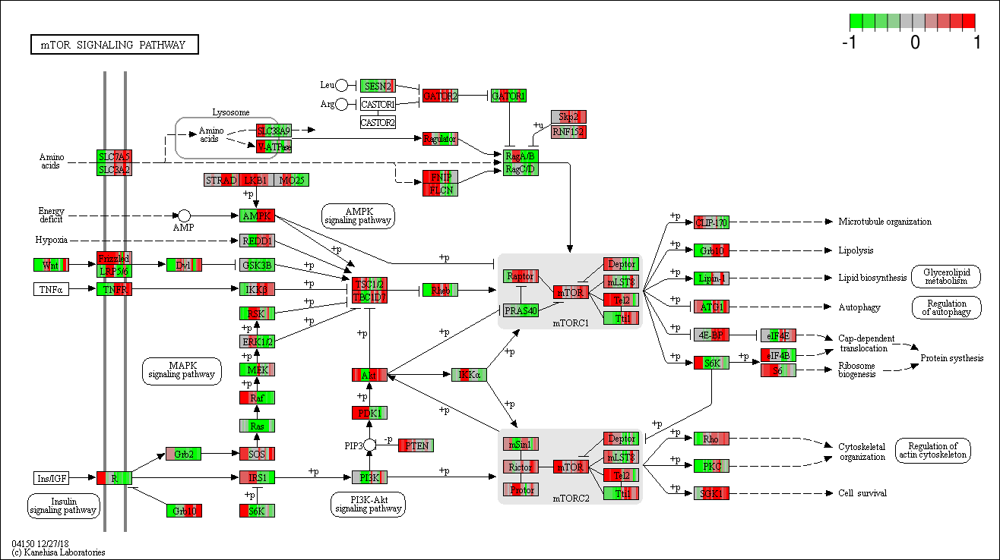

```{r setup, cache = F, echo = FALSE}
knitr::opts_chunk$set(error = TRUE,warning = FALSE)
```
# Installation
To install and load KnowSeq package in R, it is necessary the previous installation of BiocManager from Bioconductor. The next code shows how this installation can be performed:

```{r, eval=FALSE}
if (!requireNamespace("BiocManager", quietly = TRUE))
  install.packages("BiocManager")
  
BiocManager::install("KnowSeq")

library(KnowSeq)
```

KnowSeq is now available also on Docker by running the next command, allowing the use of KnowSeq without a previous installation:

```{bash, eval=FALSE}
Docker run -it casedugr/knowseq
```

# Introduction

KnowSeq proposes a novel methodology that comprises the most relevant steps in the Transcriptomic gene expression analysis. KnowSeq expects to serve as an integrative tool that allows to process and extract relevant biomarkers, as well as to assess them through a Machine Learning approaches. Finally, the last objective of KnowSeq is the biological knowledge extraction from the biomarkers (Gene Ontology enrichment, Pathway listing and Visualization and Evidences related to the addressed disease). Although the package allows analyzing all the data manually, the main strenght of KnowSeq is the possibilty of carrying out an automatic and intelligent HTML report that collect all the involved steps in one document. Nowadays, there is no package that only from the information of the samples to align -included in a text file-, automatically performs the download and alignment of all of the samples. Furthermore, KnowSeq is the only package that allows applying both a machine learning and biomarkers enrichment processes just after the biomarkers extraction. It is important to highligh that the pipeline is totally modular and flexible, hence it can be started from whichever of the different steps. This pipeline has been used in our previous publications for processing raw RNA-seq data and to perform the biomarkers extraction along with the machine learning classifier design steps, also for their integration with microarray data [1,2,3,4].



The whole pipeline included in KnowSeq has been designed carefully with the purpose of achieving a great quality and robustness in each of the steps that conform the pipeline. For that, the pipeline has four fundamental processes:

- Transcriptomic RAW data processing.
- Biomarkers identification & assessment.
- DEGs enrichment methodology.
- Intelligent Automatic Report.

The first process is focused on the Transcriptomic RAW data treatment. This step has the purpose of extracting a set of count files from raw files stored in the repositories supported by our package (NCBI/GEO [5] ArrayExpress [6] and GDC-Portal). The second one englobes the Differential Expressed Genes (DEGs) identification and extraction by using a novel parameter (Specifically for multiclass studies) defined as Coverage [3], and the assessment of those DEGs by applying advanced machine learning techniques (feature selection process and supervised classification). Once the DEGs are  assessed, the next step is the DEGs enrichment methodology which allows retrieving biological information from the DEGs. In this process, relevant information (such as related diseases, biological processes associated and pathways) about the DEGs is retrieved by using very well-known tools and databases. The three types of enrichment are the Gene Ontology (GO) study, the pathways visualization taking into account the gene expression, and the Evidences related to the addressed disease from the final set of DEGs. Finally, all of this information can be displayed on  an automatic and intelligent HTML report that contains the results of the complete study for the faced disease or diseases.

# Transcriptomic RAW data processing
## Aligners preparation

In order to avoid version incompatibilities with the aligners and the installation of the required tools, pre-compiled versions will be used to run the R functions. Consequently, all the tools were compressed and stored in an external server to be downloaded whenever it is required (http://iwbbio.ugr.es/utils/unixUtils.tar.gz). If the tools are directly downloaded from the link, the compressed files must be decompressed in the current project folder in R or RStudio. The name of the resultant folder must be *"utils"*. Nevertheless, this file can be downloaded automatically by just calling the function *rawAlignment*, in case the folder utils is not detected in the project folder. This is all needed to run the different aligners through the function *rawAlignment*. It is not possible to run the alignment without the utils folder. It must be mentioned too that the different files included in the compressed *.tar.gz* are not only the aligners but also functions needed in the raw alignment process. The tools included are the following:

- Bowtie2 [7].
- Hisat2 [8].
- Htseq-count [9].
- Kallisto [10].
- Salmon [11].
- Samtools [12].
- Sratoolkit [13].
- GDC-client.

## Launching Raw Alignment step <a name="rawStep"></a>

The *rawAlignment* function allows running different aligners, chosen by the user. The function takes as single input a CSV from GEO or ArrayExpress loaded in R. There is the possibility to process data from GDC-portal, but a previous authorization (token file) from this platform is required. Then, the user has to select with the parameter seq which aligner he wants to use, by default this parameter runs hisat2. Furthermore, there is a set of logical parameters to edit the default pipeline followed for the function. With the parameters the user can select if the BAM/SAM/Count files are created. The user can choose if wants to download the reference genome, the GTF, and which version. Even if the user has custom FASTA and GTF files, this can be specified by setting the parameter *referenceGenome* to *"custom"* and using the parameters *customFA* and *customGTF* to indicates the paths to the custom files. Other functionality is the possibility to process BAM files from the GDC Portal database by setting to *TRUE* the parameter *fromGDC*. Then the function will download the specific genome reference of GDC and process the BAM files to Count files. Furthermore, if the user has access to the controlled data, with the token and the manifest acquired from GDC Portal web platform, the samples can be downloaded automatically. An example to run the function with hisat2 aligner is showed below:

```{r, eval=FALSE} 
# Downloading one series from NCBI/GEO and one series from ArrayExpress
downloadPublicSeries(c("GSE74251"))

# Using read.csv for NCBI/GEO files (read.csv2 for ArrayExpress files)
GSE74251csv <- read.csv("ReferenceFiles/GSE74251.csv")

# Performing the alignment of the samples by using hisat2 aligner 
rawAlignment(GSE74251csv,seq="hisat2",downloadRef=TRUE,downloadSamples=TRUE,BAMfiles = TRUE,
SAMfiles = TRUE,countFiles = TRUE,referenceGenome = 38, fromGDC = FALSE, customFA = "", 
customGTF = "", tokenPath = "", manifest = "",tx2Counts = "")
```

To run the function with salmon or kallisto, it is necessary to use the parameter *tx2Counts*. The quantification files of these aligners contain the identification of the transcriptions, but for the count files it is necessary to convert these transcriptions IDs to gene IDs. To perform that, the *tx2Counts* parameter needs a matrix with two columns. One column with the transcription IDs and a second column with the correspondent gene IDs for each transcription. The package *tximportData* [14] has a set of files that contain different transcript conversion that can be used to achieve the tx2Counts matrix. An example to run the function with kallisto aligner is showed below:

```{r, eval=FALSE} 
# Downloading one series from NCBI/GEO and one series from ArrayExpress
downloadPublicSeries(c("GSE74251"))

# Using read.csv for NCBI/GEO files (read.csv2 for ArrayExpress files)
GSE74251csv <- read.csv("ReferenceFiles/GSE74251.csv")

# Loading the transcripts to genes converter variable

dir <- system.file("extdata", package="tximportData")

tx2gene <- read.csv(file.path(dir, "tx2gene.ensembl.v87.csv"))

# Performing the alignment of the samples by using kallisto aligner 

rawAlignment(GSE74251csv,seq="kallisto",downloadRef=TRUE,downloadSamples=TRUE,BAMfiles = TRUE,
SAMfiles = TRUE,countFiles = TRUE,referenceGenome = 38, fromGDC = FALSE, customFA = "",
customGTF = "", tokenPath = "", manifest = "",tx2Counts = tx2gene)
```

*RawAlignment* function creates a folder structure in the current project folder which will store all the downloaded and created files. The main folder of this structure is the folder ReferenceFiles but inside of it there are more folders that allows storing the different files used by the process in an organized way.

Another important requirement to take into account is the format of the csv file used to launch the function. It could be from three repositories, two publics (NCBI/GEO and ArrayExpress) and one controlled (GDC Portal). Each of these repositories has its own format in the csv file that contains the information to download and process the desired samples. The necessary format for each repository is explained below.


### NCBI/GEO CSV format

Series belonging to RNA-seq have a SRA identifier. If this identifier is clicked, a list with the samples that conform this series is showed. Then, the desired samples of the series can be checked and the CSV is automatically generated by clicking the button shown in the image below:



The previous selection generates a csv files that contains a number of columns with information about the samples. However, running the *rawAlignment* function only needs the three columns shown below in the csv (although the rest of the columns can be kept):

|     Run    |                            download_path                                 |  LibraryLayout |
|:----------:|:------------------------------------------------------------------------:|:--------------:|
| SRR2753177 | sra-download.ncbi.nlm.nih.gov/traces/sra21/SRR/0026... |     SINGLE     |
| SRR2753178 | sra-download.ncbi.nlm.nih.gov/traces/sra21/SRR/0026... |     SINGLE     |
| SRR2753179 | sra-download.ncbi.nlm.nih.gov/traces/sra21/SRR/0026... |     SINGLE     |

There is another way to obtain this csv automatically by calling the function *downloadPublicSeries* with the NCBI/GEO GSE ID of the wanted series, but this option does not let the user to choose the wanted samples and downloads all the samples of each selected series.

### ArrayExpress CSV format
The process for ArrayExpress is the very similar to that for NCBI/GEO. It changes the way to download the csv and the name of the columns in the file. To download the csv there is a file finished as .sdrf.txt inside the RNA-seq series in ArrayExpress, as can be seen in the example below:



As with the NCBI/GEO csv, the csv of ArrayExpress requires only three columns as is shown below:

|     Comment[ENA_RUN]    |                            Comment[FASTQ_URI]                               |  Comment[LIBRARY_LAYOUT] |
|:----------:|:------------------------------------------------------------------------:|:--------------:|
| ERR1654640 | ftp.sra.ebi.ac.uk/vol1/fastq/ERR165/000/ERR16... |     PAIRED     |
| ERR1654640 | ftp.sra.ebi.ac.uk/vol1/fastq/ERR165/000/ERR16... |     PAIRED     |

There is another way to achieve this csv automatically by calling the function downloadPublicSeries with the ArrayExpress MTAB ID of the wanted series, but this option does not let the user to choose the wanted samples, and therefore and downloads all the samples of each selected series.

### GDC Portal CSV format
GDC portal has the BAM files access restricted or controlled for the user who has access to them. However, the count files are open and can be used directly in this package as input of the function countsToMatrix. If there exist the possibility to download the controlled BAM files, the tsv file that this package uses to convert them into count files is the tsv file generated when the button Sample Sheet is clicked in the cart:



As in the other two repositories, there are a lot of columns inside the tsv files but this package only needs two of them. Furthermore, if the BAM download is carried out by the gdc-client or the web browser, the BAM has to be moved to the path *ReferenceFiles/Samples/RNAseq/BAMFiles/Sample.ID/File.Name/* where Sample.ID and File.Name are the columns with the samples information in the tsv file. This folder is created automatically in the current project folder when the *rawAlignment* function is called, but it can be created manually. However, GDC portal has public access to count files that can be used in a posterior step of the KnowSeq pipeline to merge and analyze them.

### Downloading automatically GDC Portal controlled files (GDC permission required)

It exists the possibility to download automatically the raw data from GDC portal by using the *rawAlignment* function. In order to carry this out, the function needs the parameters downloadSamples and fromGDC set to *TRUE*, the path to the token in order to obtain the authentication to download the controlled data and the path to the manifest that contains the information to download the samples. This step needs the permission of GDC portal to the controlled data.

```{r, eval=FALSE} 
# GDC portal controlled data processing with automatic raw data download

rawAlignment(x, downloadRef=TRUE, downloadSamples=TRUE, fromGDC = TRUE,
tokenPath = "~/pathToToken", manifestPath = "~/pathToManifest")
```

## Preparing the count files
From now on, the data that will be used for the documentation are real count files, but with a limited number of genes (around 1000). Furthermore, to reduce the computational cost of this example, only 5 samples from each of the two selected series will be taken into account. Showed in the code snippet below, two RNA-seq series from NCBI/GEO are downloaded automatically and the existing count files prepared to be merged in one matrix with the purpose of preparing the data for further steps:

```{r Preparing_data}
suppressMessages(library(KnowSeq))

dir <- system.file("extdata", package="KnowSeq")

# Using read.csv for NCBI/GEO files and read.csv2 for ArrayExpress files

GSE74251 <- read.csv(paste(dir,"GSE74251.csv",sep = "/"))
GSE81593 <- read.csv(paste(dir,"GSE81593.csv",sep = "/"))

# Creating the csv file with the information about the counts files location and the labels
Run <- GSE74251$Run
Path <- paste(dir,"/countFiles/",GSE74251$Run,sep = "")
Class <- rep("Tumor", length(GSE74251$Run))
GSE74251CountsInfo <-  data.frame(Run = Run, Path = Path, Class = Class)

Run <- GSE81593$Run
Path <- paste(dir,"/countFiles/",GSE81593$Run,sep = "")
Class <- rep("Control", length(GSE81593$Run))
GSE81593CountsInfo <-  data.frame(Run = Run, Path = Path, Class = Class)

mergedCountsInfo <- rbind(GSE74251CountsInfo, GSE81593CountsInfo)

write.csv(mergedCountsInfo, file = "mergedCountsInfo.csv")


```


However, the user can run a complete example by executing the following code:

```{r, eval=FALSE} 
dir <- system.file("script", package="KnowSeq")

# Code to execute the example script
source(paste(dir,"/KnowSeqExample.R",sep=""))

# Code to edit the example script
file.edit(paste(dir,"/KnowSeqExample.R",sep=""))

```

## Processing count files

After the raw alignment step, a list of count files of the samples is available at *ReferenceFiles/Samples/RNAseq/CountFiles*. The next step in the pipeline implemented in this package is the processing of those count files in order to obtain a gene expression matrix by merging all of them.

### Merging all count files 

After the alignment, as many count files as samples in the CSV used for the alignment have been created. In order to prepare the data for the DEGs analysis, it is important to merge all these files in one matrix that contains the genes Ensembl ID (or other IDs) in the rows and the name of the samples in the columns. To carry this out, the function *countsToMatrix* is available. This function reads all count files and joints them in one matrix by using edgeR package [15]. To call the function it is only necessary a CSV with the information about the count files paths. The required CSV has to have the following format:

|     Run    |             Path             |  Class  |
|:----------:|:----------------------------:|:-------:|
| SRR2753159 | ~/ReferenceFile/Count/SRR2753159/ | Tumor   |
| SRR2753162 | ~/ReferenceFile/Count/SRR2753162/ | Tumor   |
| SRR2827426 | ~/ReferenceFile/Count/SRR2827426/ | Healthy |
| SRR2827427 | ~/ReferenceFile/Count/SRR2827427/ | Healthy |

The column Run is the name of the sample without .count, the column Path is the Path to the count file and the Class column is the labels of the samples. Furthermore, an example of this function is shown below:

```{r Merging_files} 
# Merging in one matrix all the count files indicated inside the CSV file

countsInformation <- countsToMatrix("mergedCountsInfo.csv")

# Exporting to independent variables the counts matrix and the labels

countsMatrix <- countsInformation$countsMatrix

labels <- countsInformation$labels
```
The function returns a list that contains the matrix with the merged counts and the labels of the samples. It is very important to store the labels in a new variable because as it will be required in several functions of KnowSeq.

### Getting the annotation of the genes

This step is only required if the user wants to get the gene names and the annotation is retrieved with the information given by the ensembl webpage [16]. Normally, the counts matrix has the Ensembl Ids as gene identifier, but with this step, the Ensembl Ids are change by the gene names. However, the user can decide to keep its own annotation or the Ensembl Ids. For example, to achieve the gene names the function needs the current Ensembl Ids, and the reference Genome used would be the number 38. If the user wants a different annotation than the human annotation, the parameter *notHSapiens* has to be set to *TRUE* and the desired specie dataset from ensembl indicated in the parameter *notHumandataset* (i.e. “mm129s1svimj_gene_ensembl”). An example can be seen below:

```{r Downloading_annotation} 
# Downloading human annotation
myAnnotation <- getGenesAnnotation(rownames(countsMatrix))

# Downloading mus musculus annotation
myAnnotationMusMusculus <- getGenesAnnotation(rownames(countsMatrix), 
notHSapiens = TRUE,notHumandataset = "mm129s1svimj_gene_ensembl")

```
### Converting to gene expression matrix

Finally, once both the countsMatrix and the annotation are ready, it is time to convert those counts into gene expression values. For that, the function *calculateGeneExpressionValues* uses the cqn package to calculates the equivalent gene expression [17]. This function performs a conversion of counts into gene expression values, and changes the Ensembl Ids by the gene names if the parameter geneNames is equal to *TRUE*. An example of the use of this function is showed below:

```{r Calculating_gene_expression} 
# Calculating gene expression values matrix using the counts matrix

expressionMatrix <- calculateGeneExpressionValues(countsMatrix,myAnnotation,
genesNames = TRUE)
```

At this time of the pipeline, a function that plots the expression data and allows verifying if the data is well normalized can be used. This function has the purpose of joining all the important graphical representation of the pipeline in the same function and is called *dataPlot*. It is very easy to use because just by changing the parameter method many different representations can be achieved. In this case, in order to see the expression boxplot of each sample, the function has to be called with the parameter mode equal to *"boxplot"*. The labels are necessary to colour the different samples depending on the class of the samples. These colours can be selected by the user, by introducing in the parameter colours a vector with the name of the desired colours. The function also allows exporting the plots as PNG and PDF files.

```{r Plotting_boxplot} 
# Plotting the boxplot of the expression of each samples for all the genes

dataPlot(expressionMatrix,labels,mode = "boxplot", toPNG = TRUE,
toPDF = TRUE)
```

# Biomarkers identification & assessment
## Batch effect removal

A crucial step in this pipeline is the batch effect treatment. It is widely known that this is a crucial step in the omics data processing due to the intrinsic deviations that the data can present due to its origin, sequencing design, etc… Besides, when working with public data it is very difficult to know if exists a real batch effect among the selected datasets. This package allows removing batch effect if the batch groups are known by calling the function *batchEffectRemoval*, that makes use of sva package [18], with the parameter mode equal to *"combat"* [19]. This step allows obtaining an expression matrix with the batch effect treated by combat method. An example to do this is below:


```{r Removing_batch_effect_combat} 
# Removing batch effect by using combat and known batch groups 

batchGroups <- c(1,1,1,1,2,2,1,2,1,2)

expressionMatrixCorrected <- batchEffectRemoval(expressionMatrix, labels, 
batchGroups = batchGroups, method = "combat")

```

There is another method in the function that removes the batch effect that uses surrogate variable analysis or sva. The only requirement to use it is to set the parameter method equal to *"sva"*. This methodt does not return a matrix with the batch effect corrected, instead of this, the function returns a model that has to be used as single input parameter of the function *DEGsExtraction*.

```{r Removing_batch_effect_sva}
# Calculating the surrogate variable analysis to remove batch effect

svaMod <- batchEffectRemoval(expressionMatrix, labels, method = "sva")
```

## Differential Expressed Genes extraction and visualization

There is a long way between the raw data and the DEGs extraction, for that in this step the samples have to have had a strong pre-processing step applied. At this point of the pipeline the DEGs existing among two or more classes will be extracted by using the novel parameter coverage (cov) along with limma R-bioc package [20]. The parameter cov represents the number of different pathologies that a certain gen is able to discern. By default, the parameter is set to *1*, so all genes that has the capability to discern among the comparison of two classes would be selected as DEGs. To understand better this parameter, our multiclass study applied to different leukemia sub-types introduces it, and it’s publicly available [3]. 

The function *DEGsExtraction* receives an expression matrix, the labels of the samples and the restriction imposed for considering a gene as differential expressed gene. The function returns a list containing the table with statistical values of each DEGs and the expression matrix of the DEGs instead all of the genes. The call to the function is listed below:

```{r, eval=FALSE}
# Extracting DEGs that pass the imposed restrictions

DEGsInformation <- DEGsExtraction(expressionMatrixCorrected, labels,
lfc = 1.0, pvalue = 0.01, number = 100, cov = 1)

topTable <- DEGsInformation$Table

DEGsMatrix <- DEGsInformation$DEGsMatrix
```

Furthermore, if in the batch effect step the method used was sva, this function has two parameters to indicate that the model of limma would take into account the sva model calculated previously for the expression matrix. To achieve this, *svaCorrection* parameter has to be set to *TRUE* and the sva model has to be passed in the parameter *svaMod*. An example of this is the following:

```{r Extracting_DEGs_sva}
# Extracting DEGs that pass the imposed restrictions but using sva model
# calculated before to remove batch effect

DEGsInformation <- DEGsExtraction(expressionMatrix, labels, lfc = 2.0,
pvalue = 0.01, number = Inf, svaCorrection = TRUE, svaMod = svaMod, cov = 1)

topTable <- DEGsInformation$Table

DEGsMatrix <- DEGsInformation$DEGsMatrix
```

DEGs are genes that have a truly different expression among the studied classes, for that it is important to try to see graphically if those DEGs comply with this requirement. In order to provide a tool to perform this task, the function dataPlot encapsulate a set of graphs that allows plotting in different ways the expression of the DEGs.

*dataPlot* function also allows representing an ordered boxplot that internally orders the samples by class and plots a boxplot for each samples and for the first top 12 DEGs in this example. With this plot, the difference at gene expression level between the classes can be seen graphically. The code to reproduce this plot is the following:

```{r Plotting_orderded_boxplot}
# Plotting the expression of the first 12 DEGs for each of the samples in an ordered way

dataPlot(DEGsMatrix[1:12,],labels,mode = "orderedBoxplot",toPNG = FALSE,toPDF = FALSE)
```

In the previous boxplot the expression of a set of DEGs for each sample its showed, however it is interesting to see the differentiation at gene expression level for each of the top 12 genes used before separately. It is recommended to use this function with a low number of genes, because with a larger number the plot it is difficult to distinguish the information provided and R would not have enough memory to calculate the plot. For that, the function *dataPlot* with the mode *genesBoxplot* allows to do that by executing the next code:

```{r Plotting_genes_boxplot}
# Plotting the expression of the first 12 DEGs separatelly for all the samples

dataPlot(DEGsMatrix[1:12,],labels,mode = "genesBoxplot",toPNG = FALSE,toPDF = FALSE)
```

Finally, it is possible to plot one of the most widespread visualization methods in the literature, the heatmap. By setting the parameter method to *heatmap*, the function calculates the heatmap for the given samples and classes. The code to do this is the same than for the previous boxplot but changing the method parameter:

```{r Plotting_heatmap}
# Plotting the heatmap of the first 12 DEGs separatelly for all the samples

dataPlot(DEGsMatrix[1:12,],labels,mode = "heatmap",toPNG = FALSE,toPDF = FALSE)
```

## Performing the machine learning processing: classifier design and assessment and gene selection

Normally, in the literature, the last step in the pipeline for differential gene expression analysis is the DEGs extraction step. However, in this package a novel machine learning step is implemented with the purpose of giving to the user an automatic tool to assess the DEGs, and evaluate their robustness in the discernment among the studied pathologies. This library has three possible classification methodologies to take into account. These options are k-NN  [21], SVM  [22] and Random Forest [23], three of the most popular classifiers in the literature. Furthermore, it includes two different working procedures for each of them. The first one implements a cross-validation process, in order to assess the expected accuracy with different models and samples the DEGs with a specific number of folds. These functions return a list with 4 objects that contain the confusion matrices, the accuracy, the sensitivity and the specificity.

The second one is to assess a specific test dataset by using a classifier trained using the training dataset separately. Moreover, the function featureSelection allows performing a feature selection process by using, mRMR [24], Random Forest (as feature selector instead of classifier) or Disease Association based algorithms with the purpose of finding the best DEGs order to assess the data. Da-FS is a new novel method designed in KnowSeq with the purpose of giving to the expert a biological based feature selection method. This method makes use of targetValidation webplatform to acquire an association score for each DEGs with the required genetic disease, breast cancer in the example. This score takes values between 1 and 0, meaning 1 a total association and 0 no association. Therefore, the DEGs are sorted by this score, achieving a ranking in which in the first positions those DEGs with more biological relation to breast cancer are placed. 

Moreover, targetValidation webplatform allows acquiring evidences that tie a gene with a certain disease. DA-RED-FS is a novel iterative method based on DA-FS that use these evidences to calculate the redundance between genes based on biological information. This redundances take values between 1 and 0. For example, if gene A  has a redundance  of 1 with gene B, means  that all found evidences for gene A and a certain disease are also found in gene B and the disease. Likewise, if this redundance is 0, means that there are not any gene A evidences in gene B evidences. DA-RED-FS starts with an empty set of selected genes, $S_G$, and a set of possible genes $G$. In the first step, the gene with the highest DA score is selected. In the following steps, genes that verify the following equation are added to selected genes set.

$$
max_{g \in G - S_G}  DA(g) - \frac{\sum_{g_i \in S_g} RED(g,g_i)}{|S_G|} \times DA(g)
$$

Where $RED(g,g_i)$ is the redundance between gene $g$ and gen $g_i$ and $DA(g)$ is the DA score of gene $g$. The algorithms ends when a certain number of genes are selected, this number can be fixed by the maxGenes parameter.

To invoke these functions, it is necessary an expression matrix with the samples in the rows and the genes in the columns and the labels of the samples, the genes that will be assessed and the number of fold in the case of the cross-validation function. In the case of the test functions, it is necessary the matrix and the labels for both the training and the test datasets:

```{r Assessing_machine_learning_step}
DEGsMatrixML <- t(DEGsMatrix)

# Feature selection process with mRMR and RF 
mrmrRanking <- featureSelection(DEGsMatrixML,labels,colnames(DEGsMatrixML), mode = "mrmr")
rfRanking <- featureSelection(DEGsMatrixML,labels,colnames(DEGsMatrixML), mode = "rf")
daRanking <- featureSelection(DEGsMatrixML,labels,colnames(DEGsMatrixML), mode = "da", disease = "breast")

# CV functions with k-NN, SVM and RF
results_cv_knn <- knn_CV(DEGsMatrixML,labels,colnames(DEGsMatrixML)[1:10],2)

results_cv_svm <- svm_CV(DEGsMatrixML,labels,rfRanking[1:10],2)

results_cv_rf <- rf_CV(DEGsMatrixML,labels,names(daRanking)[1:10],2)

```

It is important to show graphically the results of the classifiers and for that purpose, the function *dataPlot* implements some methods. Concretely, to plot the accuracy, the sensitivity or the specificity reached by the classifiers, the function *dataPlot* has to be run with the parameter method equal to *classResults*. This method generated as many random colours as folds or simulations in the rows of the matrix passed to the function but, through the parameter colours a vector of desired colours can be specified. For the legend, the function uses the rownames of the input matrix but these names can be changed with the parameter legend. An example of this method is showed below:

```{r Plotting_ML_acc}
# Plotting the accuracy of all the folds evaluated in the CV process

dataPlot(results_cv_knn$accMatrix,mode = "classResults",
main = "Accuracy for each fold with k-NN", xlab = "Genes", ylab = "Accuracy")
```

```{r Plotting_ML_sens}
# Plotting the sensitivity of all the folds evaluated in the CV process

dataPlot(results_cv_knn$sensMatrix,mode = "classResults",
main = "Sensitivity for each fold with k-NN", xlab = "Genes", ylab = "Sensitivity")
```

```{r Plotting_ML_spec}
# Plotting the specificity of all the folds evaluated in the CV process

dataPlot(results_cv_knn$specMatrix,mode = "classResults",
main = "Specificity for each fold with k-NN", xlab = "Genes", ylab = "Specificity")
```

Furthermore, the function *dataPlot* counts with another similar mode to the previous but this time to represents confusion matrices. This mode is called *confusionMatrix* and allows creating graphically a confusion matrix with the most important statistical measures. The following code allows doing this:

```{r Plotting_ML_confs}
# Plotting the confusion matrix with the sum of the confusion matrices 
# of each folds evaluated in the CV process

allCfMats <- results_cv_knn$cfMats[[1]]$table + results_cv_knn$cfMats[[2]]$table + 
results_cv_knn$cfMats[[3]]$table + results_cv_knn$cfMats[[4]]$table + 
results_cv_knn$cfMats[[5]]$table

dataPlot(allCfMats,labels,mode = "confusionMatrix")

``` 


```{r Assessing_ML_test}
# Test functions with k-NN, SVM and RF
trainingMatrix <- DEGsMatrixML[c(1:4,6:9),]
trainingLabels <- labels[c(1:4,6:9)]
testMatrix <- DEGsMatrixML[c(5,10),]
testLabels <- labels[c(5,10)]

results_test_knn <- knn_test(trainingMatrix, trainingLabels, testMatrix,
testLabels, names(mrmrRanking)[1:10], bestK = results_cv_knn$bestK)

results_test_svm <- svm_test(trainingMatrix, trainingLabels, testMatrix,
testLabels, rfRanking[1:10], bestParameters = results_cv_svm$bestParameters)

results_test_rf <- rf_test(trainingMatrix, trainingLabels, testMatrix,
testLabels, colnames(DEGsMatrixML)[1:10])
``` 

```{r Plotting_ML_acc_test}
# Plotting the accuracy achieved in the test process

dataPlot(results_test_knn$accVector,mode = "classResults",
main = "Accuracy with k-NN", xlab = "Genes", ylab = "Accuracy")

dataPlot(results_test_svm$accVector,mode = "classResults",
main = "Accuracy with SVM", xlab = "Genes", ylab = "Accuracy")

dataPlot(results_test_rf$accVector,mode = "classResults",
main = "Accuracy with RF", xlab = "Genes", ylab = "Accuracy")
```

# DEGs enrichment methodology
The main goal of the previous pipeline is the extraction of biological relevant information from the DEGs. For that, this package provides a set of tools that allows doing it. The last step of the pipeline englobes all the available tools in KnowSeq for DEGs enrichment, where three different approaches can be taken. The gene ontology information, the pathway visualization and the relationship between the DEGs and diseases related to the studied pathologies.

## Gene Ontology
Gene ontology (GO) provides information about the biological functions of the genes. In order to complete this pipeline, it is important to know if the DEGs have functions related with the studied pathologies. In this sense, this package brings the possibility to know the GOs from the three different ontologies (BP, MF and CC) by using the function *geneOntologyEnrichment* that internally uses information from *DAVID* web-platform [20]. The function returns a list that contains a matrix for each ontology and a matrix with the GOs of the three ontologies together. Moreover, the matrices have different statistical measures and the description of the functionality of each GO.

```{r Retrieving_GOs, message=FALSE}
# Retrieving the GO information from the three different ontologies

data <- getGenesAnnotation(rownames(DEGsMatrix),attributes=c("ensembl_gene_id","external_gene_name","entrezgene_id"),filter='external_gene_name')
GOsList <- geneOntologyEnrichment(as.character(data$entrezgene_id), geneType='ENTREZ_GENE_ID', pvalCutOff=0.1, returnGeneSymbols = FALSE)
``` 

For example, in this example, the top 10 GOs from the BP ontology for the extracted DEGs are shown in the following image.


## Pathways visualization
Another important step in the enrichment methodology in this pipeline is the pathway visualization. The function uses the DEGs to show graphically the expression of the samples in the pathways in which those genes appear. For that, the function makes use of a DEGsMatrix with the expression of the DEGs and the annotation of those DEGs in which appear the pathway or pathways of each DEGs. Internally, the function *DEGsPathwayVisualization* uses *pathview* package [26] to retrieve and colour the pathways, but a maximum number of 24 samples can be used, for that, if the input matrix has more than 24 samples, only the first 24 will be used by the operation. Furthermore, the function needs the expression matrix with all the genes in order to use them to colour the rest of the elements in the pathways. It is important to retrieve the annotation from Ensembl for both the DEGsMatrix and the expressionMatrix because the entrezgene IDs and the KEGG enzyme of each gene are necessary.


```{r Downloading_pathways eval} 
# Downloading and filling with expression the pathways of the DEGs

myDEGsAnnotation <- getGenesAnnotation(rownames(DEGsMatrix)[1:3],
referenceGenome=38,attributes = c("external_gene_name","entrezgene_id"), 
filter = "external_gene_name")

allMyAnnotation <-  getGenesAnnotation(rownames(expressionMatrix),
referenceGenome=38,attributes = c("external_gene_name","entrezgene_id"), 
filter = "external_gene_name")

DEGsPathwayVisualization(DEGsMatrix[1:3,], myDEGsAnnotation, expressionMatrix,
allMyAnnotation, labels)
``` 

{ width=90% height=90% }


## Related diseases
Finally, the last enrichment method implemented is the related diseases enrichment. In this step, the function *DEGsToDisease* searches the diseases related to a list of genes or DEGs indicated as parameter. The function returns a list of diseases only for genes and also for groups of genes with several statistical values to know the relation between the diseases and the gene or group of genes. This information is retrieved from the targetValidation web platform [27]. Also, it is possible to obtain the evidences that tie diseases with each gene from targetValidation platform, setting getEvidences parameter to *TRUE*. There are seven types of evidences: known drug, literature, affected pathway, animal model, RNA expression, genetic association  or somatic mutation. Each of them contains different fields with the most important information for each one.

```{r Downloading_diseases}
# Downloading the information about the DEGs related diseases

diseasesTargetValidation <- DEGsToDiseases(rownames(DEGsMatrix), getEvidences = FALSE)

``` 


# Gene Expression Intelligent Report
Most of these steps can be displayed using a single function, *knowseqReport*, that starting from an expression matrix (or counts matrix) and the labels of the samples, will follow part of the pipeline explained above and will display the result in a report in html format.

For the obtention of this report a DEGs extraction using limma package will be performed. Then, a feature selection process will be carried out, where the used algorithm can be set by the featureSelectionMode parameter, along with the visualizations steps that have been described previously.

Following, the machine learning process starts, where the classification algorithms and the classification metrics to be displayed can be chossen by the user by clasifAlgs and metrics parameters. 

Finally DEGs enrichment is obtained, showing Gene Ontologies and found evidences for related diseases for each gene. It is possible to obtain evidences for a certain disease, specifying it by the disease parameter.

```{r, eval=FALSE} 
# Performing the automatic and intelligent KnowSeq report 
knowseqReport(expressionMatrix,labels,'knowSeq-report',clasifAlgs=c('knn','svm','rf'),disease='breast-cancer', lfc = 2, pvalue = 0.001)
```


# Session Info
```{r Session_info}
sessionInfo()
```

# References

1. Castillo, D., Gálvez, J. M., Herrera, L. J., San Román, B., Rojas, F., & Rojas, I. (2017). Integration of RNA-Seq data with heterogeneous microarray data for breast cancer profiling. BMC bioinformatics, 18(1), 506.

2. Gálvez, J. M., Castillo, D., Herrera, L. J., San Roman, B., Valenzuela, O., Ortuno, F. M., & Rojas, I. (2018). Multiclass classification for skin cancer profiling based on the integration of heterogeneous gene expression series. PloS one, 13(5), e0196836.

3. Castillo, D., Galvez, J. M., Herrera, L. J., Rojas, F., Valenzuela, O., Caba, O., ... & Rojas, I. (2019). Leukemia multiclass assessment and classification from Microarray and RNA-seq technologies integration at gene expression level. PloS one, 14(2), e0212127.

4. Gálvez, J. M., Castillo, D., Herrera, L. J., Valenzuela, O., Caba, O., Prados, J. C., ... & Rojas, I. (2019). Towards Improving Skin Cancer Diagnosis by Integrating Microarray and RNA-seq Datasets. IEEE Journal of Biomedical and Health Informatics.

5. Barrett, T., Wilhite, S. E., Ledoux, P., Evangelista, C., Kim, I. F., Tomashevsky, M., ... & Yefanov, A. (2012). NCBI GEO: archive for functional genomics data sets—update. Nucleic acids research, 41(D1), D991-D995.

6. Kolesnikov, N., Hastings, E., Keays, M., Melnichuk, O., Tang, Y. A., Williams, E., ... & Megy, K. (2014). ArrayExpress update—simplifying data submissions. Nucleic acids research, 43(D1), D1113-D1116.

7. Langmead, B., & Salzberg, S. L. (2012). Fast gapped-read alignment with Bowtie 2. Nature methods, 9(4), 357.

8. Kim, D., Langmead, B., & Salzberg, S. L. (2015). HISAT: a fast spliced aligner with low memory requirements. Nature methods, 12(4), 357.

9. Anders, S., Pyl, P. T., & Huber, W. (2015). HTSeq—a Python framework to work with high-throughput sequencing data. Bioinformatics, 31(2), 166-169.

10. Bray, N. L., Pimentel, H., Melsted, P., & Pachter, L. (2016). Near-optimal probabilistic RNA-seq quantification. Nature biotechnology, 34(5), 525.

11. Patro, R., Duggal, G., Love, M. I., Irizarry, R. A., & Kingsford, C. (2017). Salmon provides fast and bias-aware quantification of transcript expression. Nature methods, 14(4), 417.

12. Li, H. (2011). A statistical framework for SNP calling, mutation discovery, association mapping and population genetical parameter estimation from sequencing data. Bioinformatics, 27(21), 2987-2993.

13. Sherry, S., & Xiao, C. (2012, January). Ncbi sra toolkit technology for next generation sequence data. In Plant and Animal Genome XX Conference (January 14-18, 2012). Plant and Animal Genome.

14. Soneson, C., Love, M. I., & Robinson, M. D. (2015). Differential analyses for RNA-seq: transcript-level estimates improve gene-level inferences. F1000Research, 4.

15. Robinson, M. D., McCarthy, D. J., & Smyth, G. K. (2010). edgeR: a Bioconductor package for differential expression analysis of digital gene expression data. Bioinformatics, 26(1), 139-140.

16. Cunningham,  F., Achuthan, P., Akanni, W., Allen, J., ... , & Huber, W. (2018). Ensembl 2019. Nucleic Acids Research, 47(D1), D745–D751.

17. Hansen, K. D., Irizarry, R. A., & Wu, Z. (2012). Removing technical variability in RNA-seq data using conditional quantile normalization. Biostatistics, 13(2), 204-216.

18. Leek JT, Johnson WE, Parker HS, Fertig EJ, Jaffe AE, Storey JD, Zhang Y, Torres LC (2019). sva: Surrogate Variable Analysis. R package version 3.34.0.

19. Ritchie, M. E., Phipson, B., Wu, D., Hu, Y., Law, C. W., Shi, W., & Smyth, G. K. (2015). limma powers differential expression analyses for RNA-sequencing and microarray studies. Nucleic acids research, 43(7), e47-e47.

20. X Jiao, BT Sherman, R Stephens, MW Baseler, HC Lane, RA Lempicki. DAVID-WS: a stateful web service to facilitate gene/protein list analysis. Bioinformatics (2012) 28 (13): 1805-1806. doi: 10.1093/bioinformatics/bts251

21. Luo, W., & Brouwer, C. (2013). Pathview: an R/Bioconductor package for pathway-based data integration and visualization. Bioinformatics, 29(14), 1830-1831.

22. Goh, W. W. B., Wang, W., & Wong, L. (2017). Why batch effects matter in omics data, and how to avoid them. Trends in biotechnology, 35(6), 498-507.

23. Ding, C., & Peng, H. (2005). Minimum redundancy feature selection from microarray gene expression data. Journal of bioinformatics and computational biology, 3(02), 185-205.

24. Noble, W. S. (2006). What is a support vector machine?. Nature biotechnology, 24(12), 1565.

25. Parry, R. M., Jones, W., Stokes, T. H., Phan, J. H., Moffitt, R. A., Fang, H., ... & Wang, M. D. (2010). k-Nearest neighbor models for microarray gene expression analysis and clinical outcome prediction. The pharmacogenomics journal, 10(4), 292.

26. Koscielny, G., An, P., Carvalho-Silva, D., Cham, J. A., Fumis, L., Gasparyan, R., ... & Pierleoni, A. (2016). Open Targets: a platform for therapeutic target identification and validation. Nucleic acids research, 45(D1), D985-D994.
