```{r setup, cache = F, echo = FALSE}
knitr::opts_chunk$set(error = TRUE)
```

\pagebreak

# Introduction <a name="introduction"></a>

KnowSeq proposes a whole pipeline that comprises the most relevant steps in the RNA-seq gene expression analysis, with the main goal of extracting biological knowledge from raw data (Differential Expressed Genes, Gene Ontology enrichment, pathway visualization and related diseases). In this sense, KnowSeq allows aligning raw data from the original fastq or sra files, by using the most renowned aligners such as tophat2, hisat2, salmon and kallisto. Nowadays, there is no package that only from the information of the samples to align -included in a text file-, automatically performs the download and alignment of all of the samples. Furthermore, the package includes functions to: calculate the gene expression values; remove batch effect; calculate the Differentially Expressed Genes (DEGs); plot different graphs; and perform the DEGs enrichment with the GO information, pathways visualization and related diseases information retrieval. Moreover, KnowSeq is the only package that allows applying both a machine learning and DEGs enrichment processes just after the DEGs extraction. To achieve these objectives, there are functions that allows performing a feature selection process as well as a machine learning process using k-NN, RF or SVM algorithms. Similarly, there are functions allowing the retrieval of biological knowledge of the DEGs candidates. This idea emerged with the aim of proposing a complete tool to the research community containing all the necessary steps to carry out complete studies in a simple and fast way. To achieve this goal, the package uses the most relevant and widespread tools in the scientific community for the aforementioned tasks. The current version of the aligner functions works under Unix, but further version will be extended to MAC_OS and to Windows (if the tools were available). This pipeline has been used in our previous publications for processing raw RNA-seq data and to perform the DEGs extraction and the machine learning classifier design steps, also for their integration with microarray data [@castillo2017integration; @galvez2018multiclass; @castillo2019leukemia].

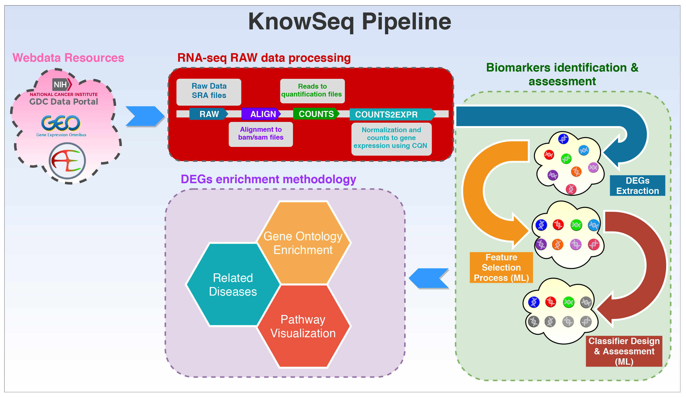

The whole pipeline included in KnowSeq has been designed carefully with the purpose of achieving a great quality and robustness in each of the steps that conform the pipeline. For that, the pipeline has three fundamental processes:

- RNA-seq RAW data processing.
- Biomarkers identification & assessment.
- DEGs enrichment methodology.

The first process is focused on the RNA-seq RAW data treatment. This step has the purpose of extracting a set of count files from raw files stored in the repositories supported by our package (NCBI/GEO [@ncbi], ArrayExpress [@arrayexpress] and GDC-Portal). The second one comprises the Differential Expressed Genes (DEGs) identification and extraction, and the assessment of those DEGs by applying advanced machine learning techniques (feature selection process and supervised classification). The last process, once the DEGs were assessed, is the DEGs enrichment methodology which allows retrieving biological information from the DEGs. In this process, relevant information (such as related diseases, biological processes associated and pathways) about the DEGs is retrieved by using very well-known tools and databases. The three types of enrichment are the Gene Ontology (GO) study, the pathways visualization taking into account the gene expression, and the related diseases to the DEGs.
With the pipeline designed and addressed by KnowSeq, researchers can convert the RAW data of RNA-seq into real knowledge on the identification of possible gene signatures about the studied diseases.

The package includes a complete example that can be executed or edited with the following code:
```r 
dir <- system.file("example", package="KnowSeq")

# Code to execute the example script
source(paste(dir,"/KnowSeqExample.R",sep=""))

# Code to edit the example script
file.edit(paste(dir,"/KnowSeqExample.R",sep=""))

```


# RNA-seq RAW data processing <a name="RNARaw"></a>
## Aligners preparation <a name="aligners"></a>

In order to avoid version incompatibilities with the aligners and the installation of the required tools, pre-compiled versions will be used to run the R functions. Consequently, all the tools were compressed and stored in an external server to be downloaded whenever it is required (http://iwbbio.ugr.es/utils/utils.tar.gz). If the tools are directly downloaded from the link, the compressed files must be decompressed in the current project folder in R or RStudio. The name of the resultant folder must be *"utils"*. Nevertheless, this file can be downloaded automatically by just calling the function *rawAlignment*, in case the folder utils is not detected in the project folder. This is all needed to run the different aligners through the function *rawAlignment*. It is not possible to run the alignment without the utils folder. It must be mentioned too that the different files included in the compressed *.tar.gz* are not only the aligners but also functions needed in the raw alignment process. The tools included are the following:

- Bowtie2 [@bowtie2].
- Hisat2 [@hisat2].
- Htseq-count [@htseq].
- Kallisto [@kallisto].
- Salmon [@salmon].
- Samtools [@samtools].
- Sratoolkit [@sratoolkit].
- Tophat2 [@tophat2].
- GDC-client.

## Launching Raw Alignment step <a name="rawStep"></a>

The *rawAlignment* function allows running different aligners, chosen by the user. The function takes as single input a CSV from GEO or ArrayExpress loaded in R. There is the possibility to process data from GDC-portal, but a previous authorization (token file) from this platform is required. Then, the user has to select with the parameter seq which aligner he wants to use, by default this parameter runs tophat2. Furthermore, there is a set of logical parameters to edit the default pipeline followed for the function. With the parameters the user can select if the BAM/SAM/Count files are created. The user can choose if wants to download the reference genome, the GTF, and which version. Even if the user has custom FASTA and GTF files, this can be specified by setting the parameter *referenceGenome* to *"custom"* and using the parameters *customFA* and *customGTF* to indicates the paths to the custom files. Other functionality is the possibility to process BAM files from the GDC Portal database by setting to *TRUE* the parameter *fromGDC*. Then the function will download the specific genome reference of GDC and process the BAM files to Count files. Furthermore, if the user has access to the controlled data, with the token and the manifest acquired from GDC Portal web platform, the samples can be downloaded automatically. An example to run the function with hisat2 aligner is showed below:

```r 
# Downloading one series from NCBI/GEO and one series from ArrayExpress

downloadPublicSeries(c("GSE74251","E-MTAB-5104"))

# Using read.csv for NCBI/GEO files and read.csv2 for ArrayExpress files

x <- read.csv("ReferenceFiles/GSE74251.csv")
y <- read.csv2("ReferenceFiles/E-MTAB-5104")

# Performing the alignment of the samples by using hisat2 aligner 

rawAlignment(x,seq="hisat2",downloadRef=TRUE,downloadSamples=TRUE,BAMfiles = TRUE,
SAMfiles = TRUE,countFiles = TRUE,referenceGenome = 38, fromGDC = FALSE, customFA = "", 
customGTF = "", fromGDC = FALSE, tokenPath = "", manifest = "",tx2Counts = "")
```

To run the function with salmon or kallisto, it is necessary to use the parameter *tx2Counts*. The quantification files of these aligners contain the identification of the transcriptions, but for the count files it is necessary to convert these transcriptions IDs to gene IDs. To perform that, the *tx2Counts* parameter needs a matrix with two columns. One column with the transcription IDs and a second column with the correspondent gene IDs for each transcription. The package *tximportData* [@tximportData] has a set of files that contain different transcript conversion that can be used to achieve the tx2Counts matrix. An example to run the function with kallisto aligner is showed below:

```r 
# Loading the transcripts to genes converter variable

dir <- system.file("extdata", package="tximportData")

tx2gene <- read.csv(file.path(dir, "tx2gene.ensembl.v87.csv"))

# Performing the alignment of the samples by using kallisto aligner 

rawAlignment(x,seq="kallisto",downloadRef=TRUE,downloadSamples=TRUE,BAMfiles = TRUE,
SAMfiles = TRUE,countFiles = TRUE,referenceGenome = 38, fromGDC = FALSE, customFA = "",
customGTF = "", fromGDC = FALSE, tokenPath = "", manifest = "",tx2Counts = tx2gene)
```

*RawAlignment* function creates a folder structure in the current project folder which will store all the downloaded and created files. The main folder of this structure is the folder ReferenceFiles but inside of it there are more folders that allows storing the different files used by the process in an organized way.

Another important requirement to take into account is the format of the csv file used to launch the function. It could be from three repositories, two publics (NCBI/GEO and ArrayExpress) and one controlled (GDC Portal). Each of these repositories has its own format in the csv file that contains the information to download and process the desired samples. The necessary format for each repository is explained below.


### NCBI/GEO CSV format

Series belonging to RNA-seq have a SRA identifier. If this identifier is clicked, a list with the samples that conform this series is showed. Then, the desired samples of the series can be checked and the CSV is automatically generated by clicking the button shown in the image below:

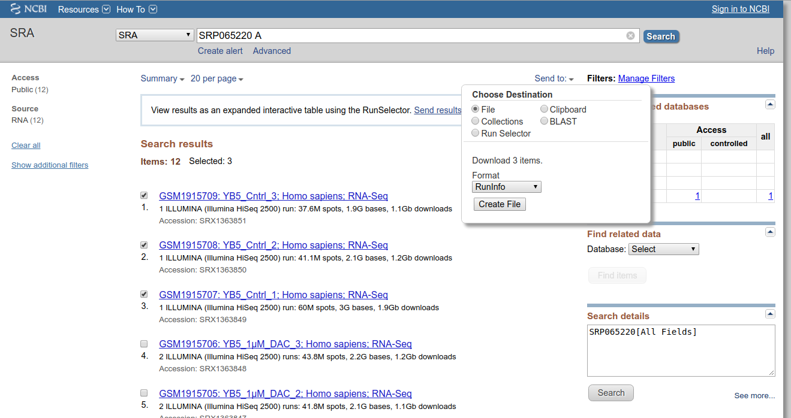

The previous selection generates a csv files that contains a number of columns with information about the samples. However, running the *rawAlignment* function only needs the three columns shown below in the csv (although the rest of the columns can be kept):

|     Run    |                            download_path                                 |  LibraryLayout |
|:----------:|:------------------------------------------------------------------------:|:--------------:|
| SRR2753177 | sra-download.ncbi.nlm.nih.gov/traces/sra21/SRR/0026... |     SINGLE     |
| SRR2753178 | sra-download.ncbi.nlm.nih.gov/traces/sra21/SRR/0026... |     SINGLE     |
| SRR2753179 | sra-download.ncbi.nlm.nih.gov/traces/sra21/SRR/0026... |     SINGLE     |

There is another way to obtain this csv automatically by calling the function *downloadPublicSeries* with the NCBI/GEO GSE ID of the wanted series, but this option does not let the user to choose the wanted samples and downloads all the samples of each selected series.

### ArrayExpress CSV format
The process for ArrayExpress is the very similar to that for NCBI/GEO. It changes the way to download the csv and the name of the columns in the file. To download the csv there is a file finished as .sdrf.txt inside the RNA-seq series in ArrayExpress, as can be seen in the example below:


As with the NCBI/GEO csv, the csv of ArrayExpress requires only three columns as is shown below:

|     Comment[ENA_RUN]    |                            Comment[FASTQ_URI]                               |  Comment[LIBRARY_LAYOUT] |
|:----------:|:------------------------------------------------------------------------:|:--------------:|
| ERR1654640 | ftp.sra.ebi.ac.uk/vol1/fastq/ERR165/000/ERR16... |     PAIRED     |
| ERR1654640 | ftp.sra.ebi.ac.uk/vol1/fastq/ERR165/000/ERR16... |     PAIRED     |

There is another way to achieve this csv automatically by calling the function downloadPublicSeries with the ArrayExpress MTAB ID of the wanted series, but this option does not let the user to choose the wanted samples, and therefore and downloads all the samples of each selected series.

### GDC Portal CSV format
GDC portal has the BAM files access restricted or controlled for the user who has access to them. However, the count files are open and can be used directly in this package as input of the function countsToMatrix. If there exist the possibility to download the controlled BAM files, the tsv file that this package uses to convert them into count files is the tsv file generated when the button Sample Sheet is clicked in the cart:

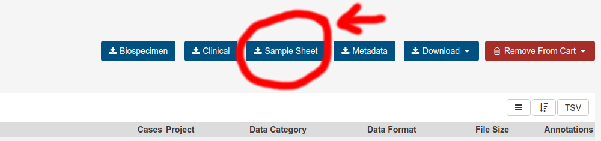

As in the other two repositories, there are a lot of columns inside the tsv files but this package only needs two of them. Furthermore, if the BAM download is carried out by the gdc-client or the web browser, the BAM has to be moved to the path *ReferenceFiles/Samples/RNAseq/BAMFiles/Sample.ID/File.Name/* where Sample.ID and File.Name are the columns with the samples information in the tsv file. This folder is created automatically in the current project folder when the *rawAlignment* function is called, but it can be created manually. However, GDC portal has public access to count files that can be used in a posterior step of the KnowSeq pipeline to merge and analyze them.

### Downloading automatically GDC Portal controlled files (GDC permission required)

It exists the possibility to download automatically the raw data from GDC portal by using the *rawAlignment* function. In order to carry this out, the function needs the parameters downloadSamples and fromGDC set to *TRUE*, the path to the token in order to obtain the authentication to download the controlled data and the path to the manifest that contains the information to download the samples. This step needs the permission of GDC portal to the controlled data.

```r 
# GDC portal controlled data processing with automatic raw data download

rawAlignment(x, downloadRef=TRUE, downloadSamples=TRUE, fromGDC = TRUE,
tokenPath = "~/pathToToken", manifestPath = "~/pathToManifest")
```

## Processing count files <a name="counts"></a>

After the raw alignment step, a list of count files of the samples is available at *ReferenceFiles/Samples/RNAseq/CountFiles*. The next step in the pipeline implemented in this package is the processing of those count files in order to obtain a gene expression matrix by merging all of them.

### Merging all count files 

After the alignment, there has to be as many count files as samples in the CSV used for the alignment. In order to prepare the data for the DEGs analysis, it is important to merge all these files in one matrix that contains the genes Ensembl ID (or other IDs) in the rows and the name of the samples in the columns. To carry this out, the function countsToMatrix is available. This function reads all count files and joints them in one matrix by using edgeR package [@edgeR]. To call the function it is only necessary a CSV with the information about the count files paths. The required CSV has to have the following format:

|     Run    |             Path             |  Class  |
|:----------:|:----------------------------:|:-------:|
| SRR2753159 | ~/ReferenceFile/Count/SRR2753159/ | Tumor   |
| SRR2753162 | ~/ReferenceFile/Count/SRR2753162/ | Tumor   |
| SRR2827426 | ~/ReferenceFile/Count/SRR2827426/ | Healthy |
| SRR2827427 | ~/ReferenceFile/Count/SRR2827427/ | Healthy |

The column Run is the name of the sample without .count, the column Path is the Path to the count file and the Class column is the labels of the samples. Furthermore, an example of this function is shown below:

```r 
# Merging in one matrix all the count files indicated inside the CSV file

countsInformation <- countsToMatrix("example.csv")

# Exporting to independent variables the counts matrix and the labels

countsMatrix <- countsInformation$countsMatrix

labels <- countsInformation$labels
```
The function returns a list that contains the matrix with the merged counts and the labels of the samples. It is very important to store the labels in a new variable because as it will be required in several functions of KnowSeq.

### Getting the annotation of the genes

This step is only required if the user wants to get the gene names and the annotation is retrieved with ensembl biomaRt package [@biomart]. Normally, the counts matrix has the Ensembl Ids as gene identifier, but with this step, the Ensembl Ids are change by the gene names. However, the user can decide to keep its own annotation or the Ensembl Ids. For example, to achieve the gene names the function needs the current Ensembl Ids and the number of the reference genome to use for the annotation (37 or 38). If the user wants a different annotation than the human annotation, the parameter *notHSapiens* has to be set to *TRUE* and the desired specie dataset from ensembl indicated in the parameter *notHumandataset* (i.e. “mmusculus_gene_ensembl”). An example can be seen below:

```r 
# Downloading human annotation
myAnnotation <- getAnnotationFromEnsembl(rownames(countMatrix),referenceGenome=37)

# Downloading mus musculus annotation
myAnnotation <- getAnnotationFromEnsembl(rownames(countMatrix), notHSapiens = TRUE,
notHumandataset = "mmusculus_gene_ensembl")

```
### Converting to gene expression matrix

Finally, once both the countsMatrix and the annotation are ready, it is time to convert those counts into gene expression values. For that, the function *calculateGeneExpressionValues* uses the cqn package to calculates the equivalent gene expression [@cqn]. This function performs a conversion of counts into gene expression values, and changes the Ensembl Ids by the gene names if the parameter geneNames is equal to *TRUE*. An example of the use of this function is showed next:

```r 
# Calculating gene expression values matrix using the counts matrix

expressionMatrix <- calculateGeneExpressionValues(countsMatrix,myAnnotation,
genesNames = T)
```

At this time of the pipeline, there is a function that plots the expression data and allows verifying if the data is well normalized. This function has the purpose of join all the important graphical representation of the pipeline in the same function and is called *dataPlot*. It is very easy to use because as only by changing the parameter method many different representations can be achieved. In this case, in order to see the expression boxplot of each sample, the function has to be called with the parameter method equal to *"boxplot"*. The labels are necessary to colour the different samples depending on the class of the samples. These colours can be selected by the user, by introducing in the parameter colours a vector with the name of the desired colours. The function also allows exporting the plots as PNG and PDF files.

```r 
# Plotting the boxplot of the expression of each samples for all the genes

dataPlot(expressionMatrix,labels,mode = "boxplot", colours = c("blue", "red"), toPNG = T,
toPDF = T)
```

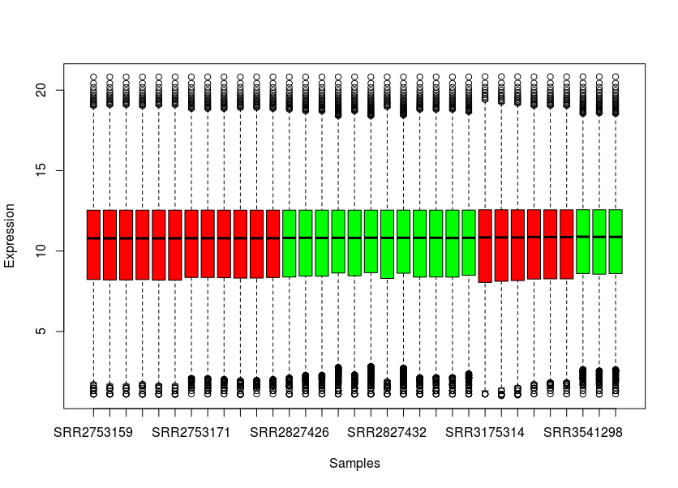

# Biomarkers identification & assessment <a name="biomarkersIDAS"></a>
## Quality analysis and batch effect removal <a name="QABatch"></a>

Before the DEGs extraction process, it is important to detect and removes any possible outlier that can be present in the samples. The outliers are samples numerically different with respect to the rest of samples, introducing noise in the study. In order to achieve that, the function *RNAseqQA* performs different statistical test by using arrayQualityMetrics bioc package. This package was designed for microarrays but it has been adapted in our function to allow RNA-seq data as input. The output of this function is the same as the output of the *arrayQualityMetrics* package [@arrayqualitymetrics], creating a new folder with an index.html file including a report about the results of the different statistical tests and the possible outliers detected by each of them.

```r 
# Performing the quality analysis of the samples

RNAseqQA(expressionMatrix)
```

The other important step in this section is the batch effect treatment. It is widely known that this is a crucial step in the omics data processing due to the intrinsic deviations that the data can present due to its origin, sequencing design, etc… Besides, when working with public data it is very difficult to know if exists a real batch effect among the selected datasets. This package provides a way of detecting possible clusters implying possible batch effect groups and correcting them [@gohBatch]. If there are batch effects in the data, it will present clusters formed because of the batch effect influence. For that, first, the function *dataPlot* with the parameter method equal to *"optimalClusters"* has to be run with the purpose of detecting the optimal number of clusters existing in the samples. Furthermore, this clusters can be represented graphically by calling the function dataPlot again but this time with the parameter method equal to *"knnClustering"*. Once the optimal number of clusters is calculated, the second and final step to remove the batch effect is by calling the function *batchEffectRemoval*, that makes use of sva package [@sva], with the parameter method equal to *"combat"* and the parameter clusters equal to the optimal number of clusters calculated before. This step allows obtaining an expression matrix with the batch effect treated by combat method. An example to do this is below:


```r 
# Calculating the optimal number of clusters presented in the samples in order to 
# try to identificate the batch effect groups to remove it by combat method

dataPlot(expressionMatrix,labels,mode = "optimalClusters",toPNG = T,toPDF = T)

dataPlot(expressionMatrix,labels,mode = "knnClustering", clusters = 4,toPNG = T,toPDF = T)

expressionMatrixCorrected <- batchEffectRemoval(expressionMatrix, labels, clusters = 4,
method = "combat")
```

There is another method in the function that removes the batch effect and it is by using surrogate variable analysis or sva. To use this method, it is not necessary to calculates the optimal number of clusters, the only requirement to use it is to set the parameter method equal to *"sva"*. This method does not return a matrix with the batch effect corrected, instead of this, the function returns a model that has to be used as single input parameter of the function *limmaDEGsExtraction*.

```r
# Calculating the surrogate variable analysis to remove batch effect

svaMod <- batchEffectRemoval(expressionMatrix, labels, method = "sva")
```

## Differential Expressed Genes extraction and visualization <a name="DEGsextr"></a>

There is a long way between the raw data and the DEGs extraction, for that in this step the samples have to have had a strong pre-processing step applied. At this point of the pipeline the DEGs existing among two or more classes will be extracted using the most extended library for that called limma. The function *limmaDEGsExtraction* receives an expression matrix, the labels of the samples and the restriction imposed for considering a gene as differential expressed gene. The function returns a list containing the table with statistical values of each DEGs and the expression matrix of the DEGs instead all of the genes. The well-known limma package is used internally to perform the DEGs extraction [@limma]. The call to the function is listed below:

```r
# Extracting DEGs that pass the imposed restrictions

DEGsInformation <- limmaDEGsExtraction(expressionMatrixNoBatch, labels,
lfc = 1.0, pvalue = 0.01, number = 100)

topTable <- DEGsInformation$Table

DEGsMatrix <- DEGsInformation$DEGsMatrix
```

Furthermore, if in the batch effect step the method used was sva, this function has two parameters to indicate that the model of limma would take into account the sva model calculated previously for the expression matrix. To achieve this, *svaCorrection* parameter has to be set to *TRUE* and the sva model has to be passed in the parameter *svaMod*. An example of this is the following:

```r
# Extracting DEGs that pass the imposed restrictions but using sva model
# calculated before to remove batch effect

DEGsInformation <- limmaDEGsExtraction(expressionMatrix, labels, lfc = 1.0,
pvalue = 0.01, number = 100, svaCorrection = TRUE, svaMod = svaMod)

topTable <- DEGsInformation$Table

DEGsMatrix <- DEGsInformation$DEGsMatrix
```

The function also detects automatically if the labels have more than two classes and calculates the limma multiclass DEGs extraction in this case. In order to do that correctly, there is a parameter called cov that represents the number of different pathologies that a certain gen is able to discern. By default, the parameter is set to *1*, so all genes that has the capability to discern among the comparison of two classes would be selected as DEGs. To understand better this parameter, our multiclass study applied to different leukemia sub-types introduces it, and it’s publicly available [see @castillo2019leukemia].

DEGs are genes that have a truly different expression among the studied classes, for that it is important to try to see graphically if those DEGs comply with this requirement. In order to provide a tool to perform this task, the function dataPlot encapsulate a set of graphs that allows plotting in different ways the expression of the DEGs.

*dataPlot* function also allows representing an ordered boxplot that internally orders the samples by class and plots a boxplot for each samples and for the first top 12 DEGs in this example. With this plot, the difference at gene expression level between the classes can be seen graphically. The code to reproduce this plot is the following:

```r
# Plotting the expression of the first 12 DEGs for each of the samples in an ordered way

dataPlot(DEGsMatrix[1:12,],labels,mode = "orderedBoxplot",toPNG = F,toPDF = F)
```

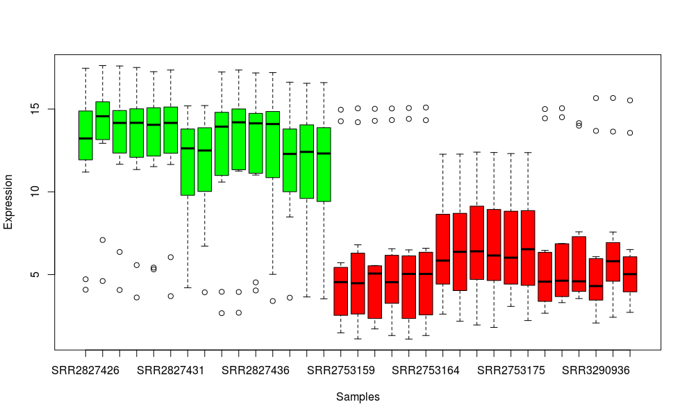

In the previous boxplot the expression of a set of DEGs for each sample its showed, however it is interesting to see the differentiation at gene expression level for each of the top 12 genes used before separately. It is recommendable to use this function with a low number of genes, because with a larger number the plot it is difficult to distinguish the information provided and R would not have enough memory to calculate the plot. For that, the function *dataPlot* with the mode *genesBoxplot* allows to do that by executing the next code:

```r
# Plotting the expression of the first 12 DEGs separatelly for all the samples

dataPlot(DEGsMatrix[1:12,],labels,mode = "genesBoxplot",toPNG = F,toPDF = F)
```

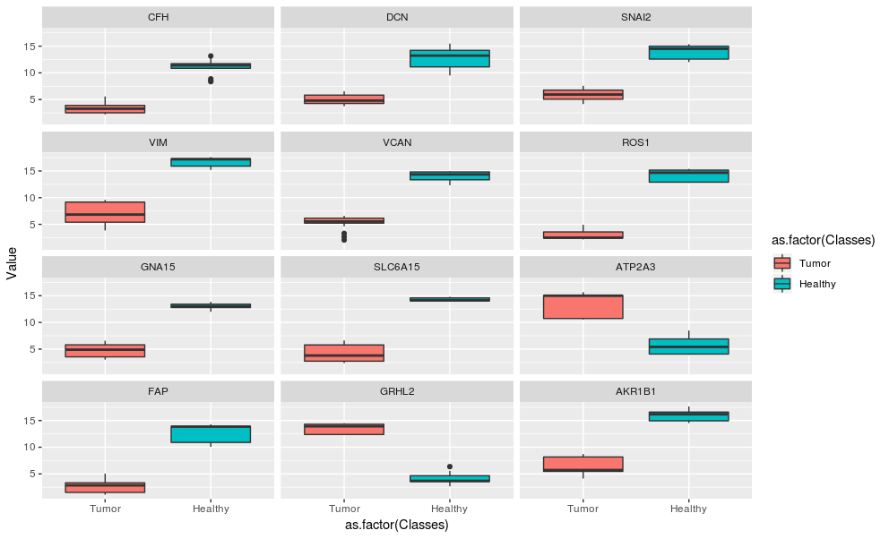

Finally, it is possible to plot one of the most widespread visualization methods in the literature, the heatmap. By setting the parameter method to *heatmap*, the function calculates the heatmap for the given samples and classes. The code to do this is the same than for the previous boxplot but changing the method parameter:

```r
# Plotting the heatmap of the first 12 DEGs separatelly for all the samples

dataPlot(DEGsMatrix[1:12,],labels,mode = "heatmap",toPNG = F,toPDF = F)
```

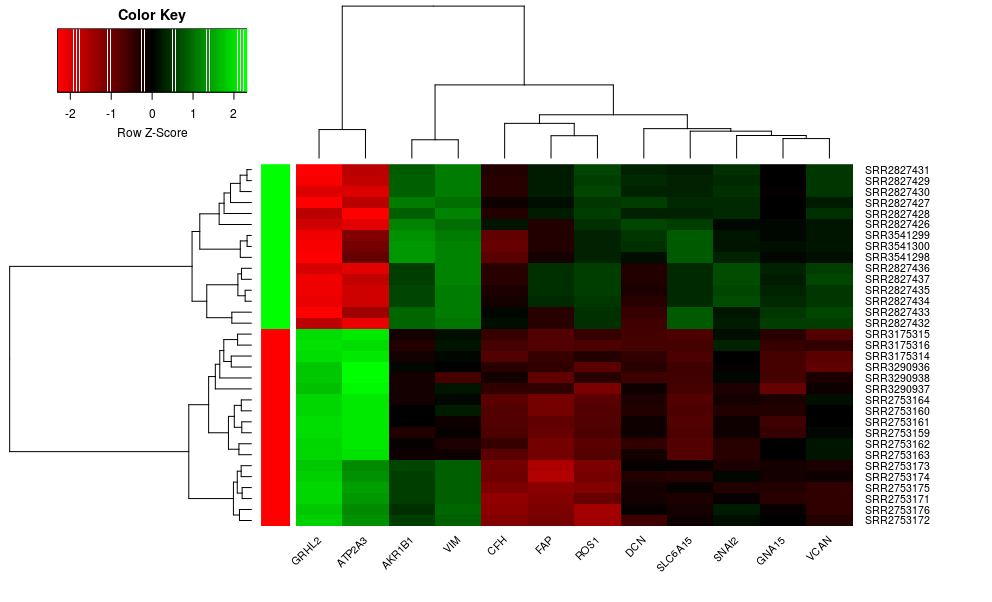

## Performing the machine learning processing: classifier design and assessment and gene selection. <a name="machineLearning"></a>

Normally, in the literature, the last step in the pipeline for differential gene expression analysis is the DEGs extraction step. However, in this package a novel machine learning step is implemented with the purpose of giving to the user an automatic tool to assess the DEGs, and evaluate their robustness in the discernment among the studied pathologies. This library has three possible classification methodologies to take into account. These options are k-NN  [@knn], SVM  [@svm] and Random Forest  [@randomforest], three of the most popular classifiers in the literature. Furthermore, it includes two different working procedures for each of them. The first one implements a cross-validation process, in order to assess the expected accuracy with different models and samples the DEGs with a specific number of folds. The second one is to assess a specific test dataset by using a classifier trained using the training dataset separately. Moreover, the function featureSelection allows performing a feature selection process by using either mRMR[@mrmr] or Random Forest (as feature selector instead of classifier) algorithms with the purpose of finding the best DEGs order to assess the data. The functions return a list with 4 objects that contain the confusion matrices, the accuracy, the sensitivity and the specificity.

To invoke these functions, it is necessary an expression matrix with the samples in the rows and the genes in the columns and the labels of the samples, the genes that will be assessed and the number of fold in the case of the cross-validation function. In the case of the test functions, it is necessary the matrix and the labels for both the training and the test datasets:

```r
# Feature selection process with mRMR and RF 
mrmrRanking <- featureSelection(DEGsMatrix,labels,rownames(DEGsMatrix), mode = "mrmr")
rfRanking <- featureSelection(DEGsMatrix,labels,rownames(DEGsMatrix), mode = "rf")

# CV functions with k-NN, SVM and RF
results_cv_knn <- knn_CV(t(DEGsMatrix),labels,rownames(DEGsMatrix)[1:10],5)

results_cv_svm <- svm_CV(t(DEGsMatrix),labels,rfRanking,5)

results_cv_rf <- rf_CV(t(DEGsMatrix),labels,mrmrRanking,5)

```

It is important to show graphically the results of the classifiers and for that purpose, the function *dataPlot* implements some methods. Concretely, to plot the accuracy, the sensitivity or the specificity reached by the classifiers, the function *dataPlot* has to be run with the parameter method equal to *classResults*. This method generated as many random colours as folds or simulations in the rows of the matrix passed to the function but, through the parameter colours a vector of desired colours can be specified. For the legend, the function uses the rownames of the input matrix but these names can be changed with the parameter legend. An example of this method is showed below:

```r
# Plotting the accuracy of all the folds evaluated in the CV process

dataPlot(results_cv_knn$accMatrix,mode = "classResults",
main = "Accuracy for each fold", xlab = "Genes", ylab = "Accuracy")
```

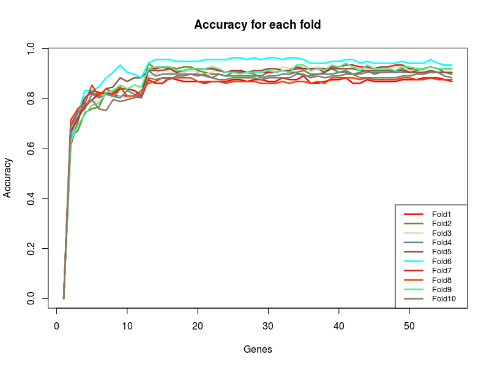

```r
# Plotting the sensitivity of all the folds evaluated in the CV process

dataPlot(results_cv_knn$sensMatrix,mode = "classResults",
main = "Sensitivity for each fold", xlab = "Genes", ylab = "Sensitivity")
```
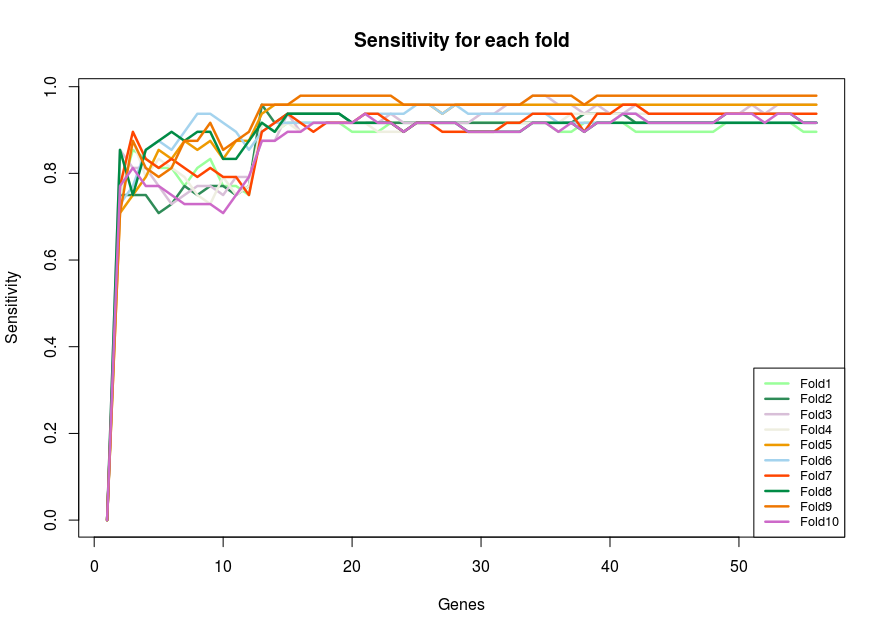

```r
# Plotting the specificity of all the folds evaluated in the CV process

dataPlot(results_cv_knn$specMatrix,mode = "classResults",
main = "Specificity for each fold", xlab = "Genes", ylab = "Specificity")
```
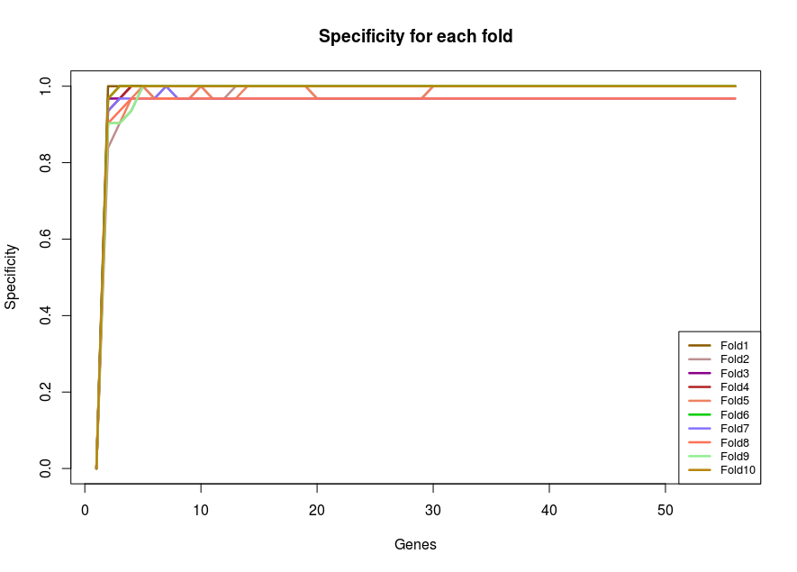


Furthermore, the function *dataPlot* counts with another similar mode to the previous but this time to represents confusion matrices. This mode is called *confusionMatrix* and allows creating graphically a confusion matrix with the most important statistical measures. The following code allows doing this:

```r
# Plotting the confusion matrix with the sum of the confusion matrices 
# of each folds evaluated in the CV process

allCfMats <- results_cv_knn$cfMats[[1]]$table + results_cv_knn$cfMats[[2]]$table + 
results_cv_knn$cfMats[[3]]$table + results_cv_knn$cfMats[[4]]$table + 
results_cv_knn$cfMats[[5]]$table + results_cv_knn$cfMats[[6]]$table + 
results_cv_knn$cfMats[[7]]$table + results_cv_knn$cfMats[[8]]$table + 
results_cv_knn$cfMats[[9]]$table + results_cv_knn$cfMats[[10]]$table

dataPlot(allCfMats,labels,mode = "confusionMatrix")

``` 

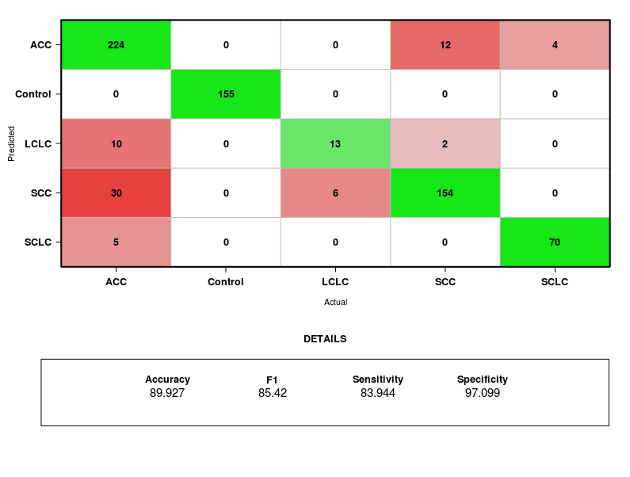


```r
# Test functions with k-NN, SVM and RF
results_test_knn <- knn_test(trainingMatrix, trainingLabels, testMatrix,
testLabels, mrmrRanking)

results_test_svm <- svm_test(trainingMatrix, trainingLabels, testMatrix,
testLabels, rownames(DEGsMatrix)[1:10])

results_test_rf <- rf_test(trainingMatrix, trainingLabels, testMatrix,
testLabels, rownames(DEGsMatrix)[1:10])
``` 

# DEGs enrichment methodology <a name="DEGsEnrichment"></a>
The main goal of the previous pipeline is the extraction of biological relevant information from the DEGs. For that, this package provides a set of tools that allows doing it. The last step of the pipeline conformed by all the available tools in KnowSeq is the DEGs enrichment and this enrichment has three different points of view. The gene ontology information, the pathway visualization and the relationship between the DEGs and diseases related to the studied pathologies.

## Gene Ontology <a name="GO"></a>
Gene ontology (GO) provides information about the biological functions of the genes. In order to complete this pipeline, it is important to know if the DEGs have functions related with the studied pathologies. In this sense, this package brings the possibility to know the GOs from the three different ontologies (BP, MF and CC) by using the function *geneOntologyEnrichment* that internally used the packaged *topGO* [@topgo]. The only requirement is to put the label of first class to *1* and the label of the second class to *0*. Furthermore, with the parameter *nGOs*, the number of resultant GOs that are returned can be modified. The function returns a list that contains a matrix for each ontology and a matrix with the GOs of the three ontologies together. Moreover, the matrices have different statistical measures and the description of the functionality of each GO.

```r
# Retrieving the GO information from the three different ontologies

labelsGo <- gsub("Healthy",0,labels)

labelsGo <- gsub("Tumor",1,labelsGo)

GOsMatrix <- geneOntologyEnrichment(DEGsMatrix,labelsGo,nGOs = 20)
``` 

For example, in this example, the top 10 GOs from the BP ontology for the extracted DEGs are shown in the following image.

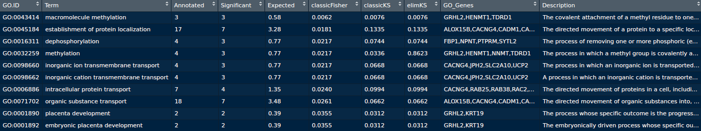

## Pathways visualization <a name="paths"></a>
Another important step in the enrichment methodology in this pipeline is the pathway visualization. The function uses the DEGs to show graphically the expression of the samples in the pathways in which those genes appear. For that, the function makes use of a DEGsMatrix with the expression of the DEGs and the annotation of those DEGs in which appear the pathway or pathways of each DEGs. Internally, the function *DEGsPathwayVisualization* uses *pathview* package [@pathview] to retrieve and colour the pathways, but a maximum number of 24 samples can be used, for that, if the input matrix has more than 24 samples, only the first 24 will be used by the operation. Furthermore, the function needs the expression matrix with all the genes in order to use them to colour the rest of the elements in the pathways. It is important to retrieve the annotation from Ensembl for both the DEGsMatrix and the expressionMatrix because the entrezgene IDs and the KEGG enzyme of each gene are necessary.


```r 
# Downloading and filling with expression the pathways of the DEGs

myDEGsAnnotation <- getAnnotationFromEnsembl(rownames(DEGsMatrix),
referenceGenome=38,attributes = c("external_gene_name","entrezgene",
"gene_biotype","kegg_enzyme"), filters = "external_gene_name")

allMyAnnotation <-  getAnnotationFromEnsembl(rownames(expressionMatrix),
referenceGenome=38,attributes = c("external_gene_name","entrezgene","gene_biotype",
"kegg_enzyme"), filters = "external_gene_name")

DEGsPathwayVisualization(DEGsMatrix, myDEGsAnnotation, expressionMatrix,
allMyAnnotation, labels)
``` 

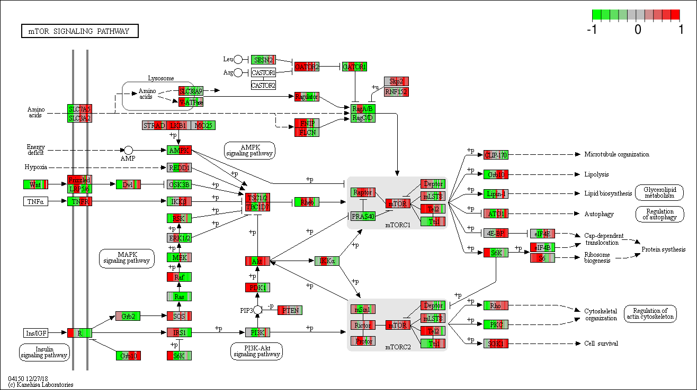{ width=90% height=90% }


## Related diseases <a name="diseases"></a>
Finally, the last enrichment method implemented is the related diseases enrichment. In this step, the function *DEGsToDisease* searchs the diseases related to a list of genes or DEGs indicated as parameter. The function returns a list of diseases only for genes and also for group of genes with several statistical values to know the relation between the diseases and the gene or group of genes. This information is retrieved from the Gene Set to Diseases web platform [@fontaine2016gene].

```r
# Downloading the information about the DEGs related diseases

diseases <- DEGsToDiseases(rownames(DEGsMatrix))
``` 
For example, the image below shows the diseases related only with KRT19 gene that the function returns.

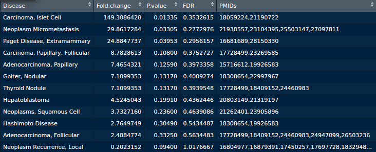

# References

